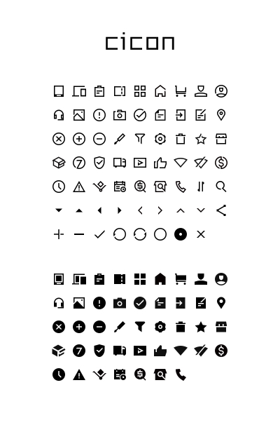

# cicon

#### preview



#### How to use

```html
<link rel="stylesheet" href="cicon_style.css">
```

#### Example

```html
<html>
<head>
	<meta charset="UTF-8">
	<link rel="stylesheet" href="cicon_style.css">
</head>
<body>
	<span class="cicon-telephone"></span>
</body>
</html>
```

